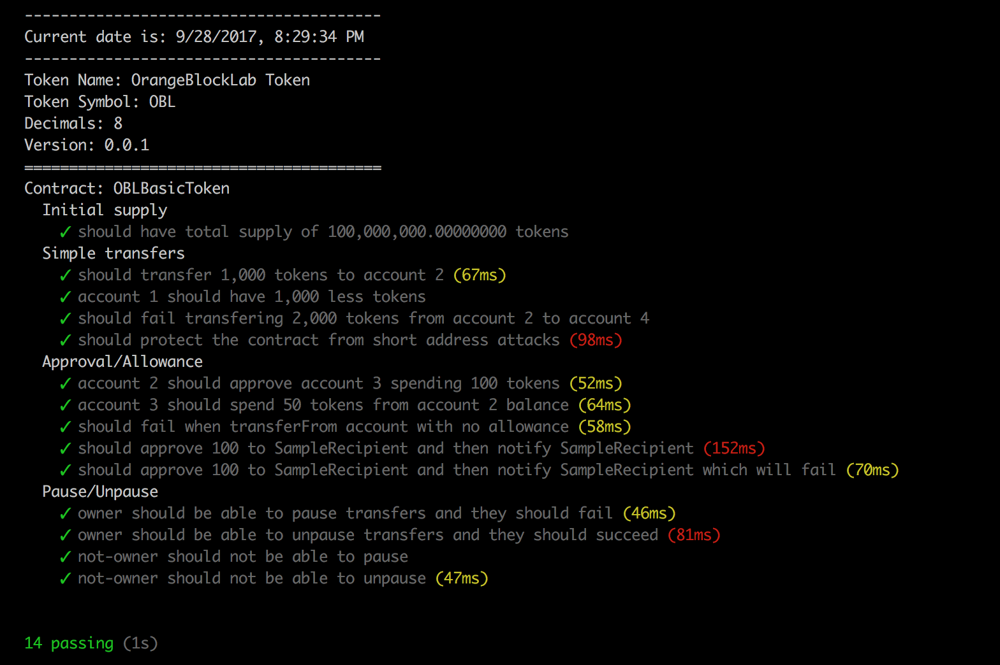

# OrangeBlockLab OBL Basic Token

This is implementation of ERC20 OBL Basic token.

Implementation supports also following protections:
- Pause and Unpause transfers
- Short address protection
- Peterson's Law Protection

## Implementation

The basic OBL token system is implemented using Solidity, the most widely used high level language targeting the EVM and Open Zeppelin framework. 

### Test Results

Following is test results that we have


  
#### Instructions

To install the OpenZeppelin library, run:
```sh
npm install zeppelin-solidity

# If you are using yarn, add dependency like this -
yarn add zeppelin-solidity
```

##### Copyright &copy; 2017  OrangeBlockLab.
