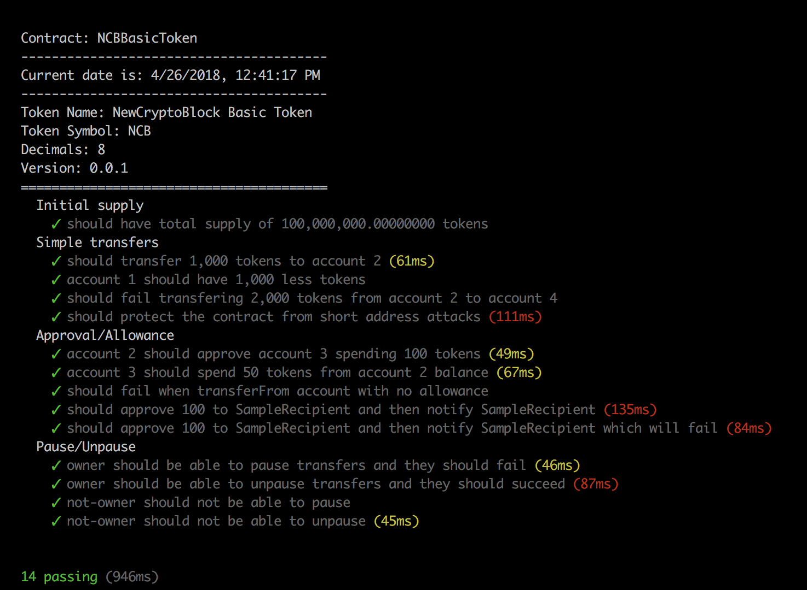
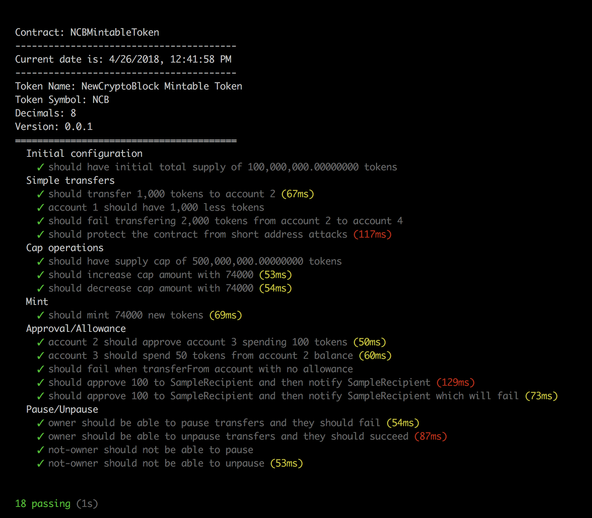

# NewCryptoBlock NCB Token

This is implementation of ERC20 NCB tokens.

## Implementations

The NCB tokens are implemented using [Solidity](http://solidity.readthedocs.io "Solidity"), the most widely used high level language targeting the EVM and [Open Zeppelin](https://openzeppelin.org/ "Open Zeppelin") framework. [Truffle Framework](http://truffleframework.com "Truffle Framework") is used for easy compilation, migration and testing.

### NCBToken

Basic ERC implementation supporting following protections:
- Pause and Unpause transfers
- Short address protection
- Peterson's Law Protection

### NCBBasicToken

Inherits NCBToken with following additional support:
- Initial token total supply

#### Test Results

Following is test results that we have



### NCBMintableToken

Inherits NCBToken with following additional support:
- Initial token supply
- Max cap token amount
- Minting tokens

#### Test Results

Following is test results that we have


  
### Instructions

To install the OpenZeppelin library, run:
```sh
git submodule update --init --recursive
```

To install Truffle framework, run:
```sh
npm install -g truffle
```

##### Copyright &copy; 2018 NewCryptoBlock.
